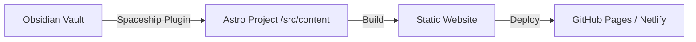

# Obsidian Spaceship 🚀

**A dual-engine publishing system for your Digital Garden.**

This project contains two parts that work together:
1.  **The Theme (`/`)**: A high-performance, minimalist Astro blog theme.
2.  **The Commander (`packages/obsidian-plugin`)**: An Obsidian plugin that beams your notes directly into the theme.

## Architecture



## How to Use

### 1. Setup the Blog (The Theme)
This repository IS your blog.
1.  **Install dependencies**: `npm install`
2.  **Run locally**: `npm run dev`
3.  **Customize**: Edit `src/layouts` or `src/styles/global.css`.

### 2. Setup the Plugin (The Commander)
The plugin lives in `packages/obsidian-plugin`.
1.  **Build the plugin**:
    ```bash
    cd packages/obsidian-plugin
    npm install
    npm run build
    ```
2.  **Install into Obsidian**:
    *   Create a folder inside your Vault: `.obsidian/plugins/spaceship-commander`
    *   Copy `main.js` and `manifest.json` from `packages/obsidian-plugin` to that folder.
    *   Enable "Spaceship Commander" in Obsidian Community Plugins.

### 3. Connect Them
1.  Open Obsidian Settings -> **Spaceship Commander**.
2.  Set **Blog Repository Path** to the absolute path of this folder on your computer.
    *   Example: `/Users/me/projects/obsidian-spaceship`

### 4. Publish
1.  Open a note in Obsidian.
2.  Run command: **"Spaceship: Publish Current Note"**.
3.  The note is copied to `src/content/posts` in this repo.
4.  Commit and push this repo to deploy!

## Features
- **Obsidian-First**: Write in your vault, publish with one click.
- **Full Control**: The theme is yours to hack. No hidden magic.
- **Fast**: Built on Astro + Tailwind.

## Development
This is a monorepo.
- `src/`: The Astro site source.
- `packages/`: Helper packages and the Obsidian plugin.
